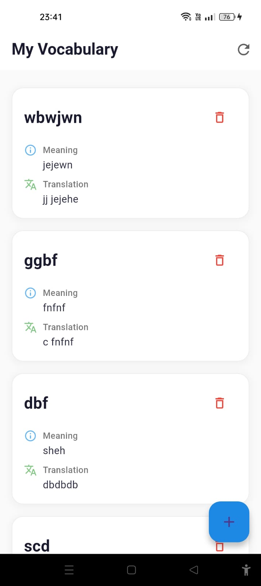
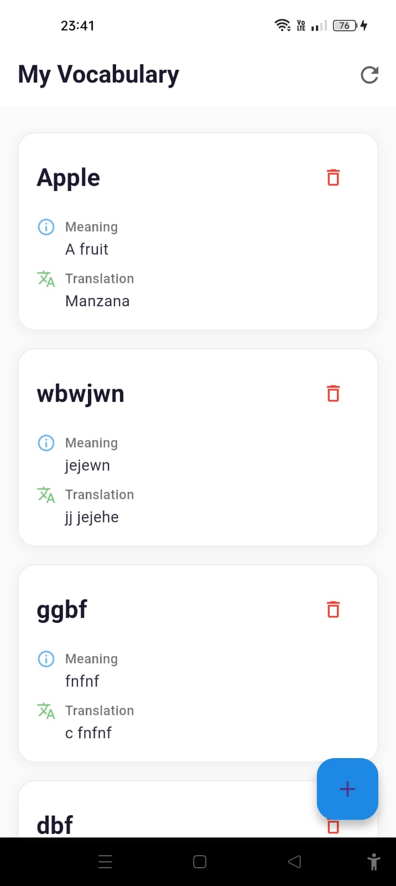
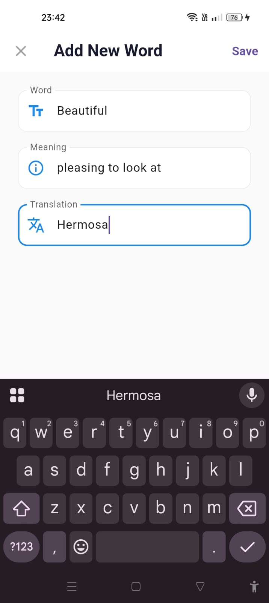
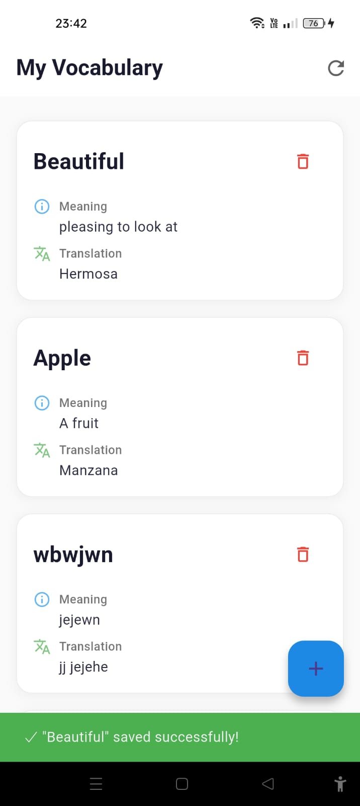

## lingobreeze

A complete implementation of the **My Vocabulary** feature for the **lingobreeze** language-learning app. This project demonstrates a production-ready vocabulary management system built with Clean Architecture principles, Firebase integration, and a scalable Node.js backend.

---

## Features

* Add new vocabulary words and phrases
* Real-time cloud synchronization using Firebase Firestore
* RESTful API integration with Node.js backend
* Clean and responsive Flutter UI

---

## Tech Stack

* Flutter
* Dart
* Cloud Firestore
* Node.js
* Clean Architecture
* Express.js

---

## Screenshots

<table>
  <tr>
    <td></td>
    <td></td>
  </tr>
  <tr>
    <td></td>
    <td></td>
  </tr>
</table>

---

## Architecture Highlights

* Feature-based project structure
* Separation of Presentation, Domain, and Data layers
* Repository Pattern implementation
* Dependency Injection
* Error handling and validation
* Scalable backend API design
* Firebase-powered storage

---
## Project Structure

```text
lingobreeze/
├── backend/
│   ├── package.json
│   ├── server.js
│   └── firebase-admin.json 
├── flutter-app/
│      lib/
│       ├── main.dart
│       ├── core/
│       │   ├── constants/
│       │   │   └── app_constants.dart
│       │   └── utils/
│       │       └── error_handler.dart
│       ├── data/
│       │   ├── models/
│       │   │   └── word_model.dart
│       │   ├── datasources/
│       │   │   └── word_remote_datasource.dart
│       │   └── repositories/
│       │       └── word_repository_impl.dart
│       ├── domain/
│       │   ├── entities/
│       │   │   └── word.dart
│       │   ├── repositories/
│       │   │   └── word_repository.dart
│       │   └── usecases/
│       │       ├── get_words.dart
│       │       └── save_word.dart
│       ├── presentation/
│       │   ├── pages/
│       │   │   ├── my_vocabulary_page.dart
│       │   │   └── add_word_page.dart
│       │   ├── widgets/
│       │   │   ├── word_card.dart
│       │   │   ├── loading_widget.dart
│       │   │   ├── empty_state_widget.dart
│       │   │   └── error_widget.dart
│       │   └── bloc/
│       │       ├── word_bloc.dart
│       │       ├── word_event.dart
│       │       └── word_state.dart
│       └── injection/
│           └── dependency_injection.dart
│   
│   
└── README.md

## Installation

### 1. Clone the repository

```bash
git clone https://github.com/shiyascholayil/lingobreeze.git
```

### 2. Navigate to the project

```bash
cd lingobreeze
```

### 3. Install dependencies

```bash
flutter pub get
```

### 4. Run the application

```bash
flutter run
```

---

## Backend Setup

### Install backend dependencies

```bash
cd backend
npm install
```

### Start the backend server

```bash
npm start
```

---

## Firebase Setup

Before running the project:

1. Create a Firebase project
2. Enable Cloud Firestore
3. Configure Firebase for Flutter
4. Add `google-services.json` (Android)
5. Update Firebase configuration files

---

## Project Purpose

This project was developed to demonstrate a real-world vocabulary management feature for language-learning applications while following modern software engineering best practices.

Key learning areas include:

* Flutter application development
* Clean Architecture implementation
* Cloud Firestore database management
* REST API development with Node.js
* State management and scalable app structure

---

## Future Enhancements

* Vocabulary categories and tags
* Spaced repetition learning system
* Word pronunciation support
* Example sentences and translations
* Offline mode with local caching
* Learning analytics and progress tracking
* Vocabulary import/export functionality

---

## Author

**Shiyas Cholayil**

GitHub: https://github.com/shiyascholayil


